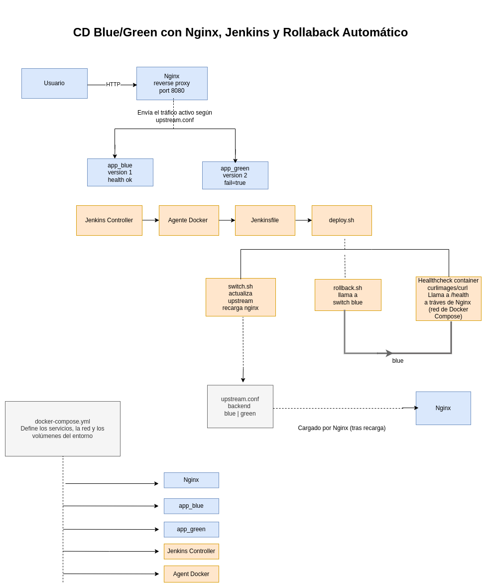

# Despliegue Blue/Green con Nginx, Jenkins y Rollback Automático

## 📌 Descripción

Uno de los riesgos más comunes en un despliegue no está en la build, sino en lo que ocurre **cuando una nueva versión pasa a estar activa**.

Si una release falla al recibir tráfico real y no existe un mecanismo de validación y rollback automático, el impacto puede ser inmediato.

Este proyecto muestra una solución sencilla pero efectiva para reducir ese riesgo mediante:

- Estrategia de despliegue Blue/Green
- Nginx como reverse proxy
- Pipeline de Jenkins para automatización
- Validación mediante healthcheck
- Rollback automático en caso de fallo


## 🏗 Arquitectura



## ⚙️ Funcionamiento

1. Se despliegan dos versiones de la aplicación:
   - **app_blue** (versión estable)
   - **app_green** (nueva versión)

2. Nginx actúa como punto de entrada y enruta el tráfico al backend activo.

3. El pipeline de Jenkins:
   - Levanta el entorno con Docker Compose
   - Cambia el tráfico a la nueva versión (green)
   - Ejecuta un healthcheck a través de Nginx

4. Si el healthcheck falla:
   - El tráfico vuelve automáticamente a la versión estable (blue)

De esta forma, una release defectuosa nunca permanece activa.


## 📁 Estructura del proyecto
```
.
├── app/# Aplicación Node.js
├── nginx/# Configuración de Nginx
├── scripts/# Lógica de deploy, healthcheck, rollback y switch
├── docs/
│   └── images/# Diagramas y recursos visuales
├── docker-compose.yml
└── Jenkinsfile
```


## 🧩 Componentes clave

- **app_blue / app_green** → Dos versiones de la aplicación
- **Nginx** → Punto de entrada y router de tráfico
- **Jenkins** → Orquestación del pipeline
- **Agent Docker** → Ejecuta el pipeline con acceso a Docker
- **deploy.sh** → Orquesta el flujo de despliegue
- **switch.sh** → Actualiza el backend activo en Nginx
- **rollback.sh** → Restaura la versión anterior
- **Healthcheck container** → Valida la release a través del flujo real de tráfico


## 🔄 Flujo de despliegue

1. Se levantan los servicios con Docker Compose
2. Se cambia el tráfico a la versión **green**
3. Se ejecuta un healthcheck a través de Nginx
4. Si es correcto → la versión green se mantiene activa
5. Si falla → rollback automático a la versión blue


## 🎯 Valor

Este enfoque permite:

- Reducir el riesgo en despliegues
- Detectar fallos tras activar una release
- Evitar intervención manual
- Reducir el tiempo de recuperación (MTTR)
- Aumentar la confianza en el pipeline


## ▶️ Ejecución

```bash
docker compose up --build

---

## 💡 Notas

Esta es una implementación simplificada enfocada en demostrar el concepto de despliegue controlado con rollback automático.

Se puede extender con:

- Monitorización (Prometheus, Grafana)
- Canary deployments
- Integración con entornos reales

---
```

## 👩‍💻 Autor

Hecho con ❤️ por Melissa Melendez · DevOps & Cloud